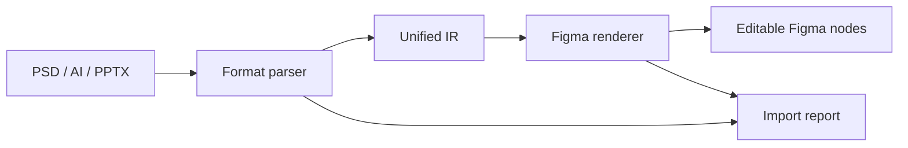

# Easy to Figma

English | [简体中文](./README.md)

[](https://github.com/FishXIN/easy-to-figma/actions/workflows/ci.yml)
[](./LICENSE)
[](https://www.typescriptlang.org/)
[](https://www.figma.com/plugin-docs/)

**Bring PSD, Illustrator, and PowerPoint files into Figma while preserving as much editability as possible.**

Easy to Figma is a free, open-source, cross-platform Figma import tool. Source files are converted into a unified intermediate representation, rebuilt with native Figma nodes, and accompanied by a clear report whenever unsupported content needs a controlled fallback.


## Format Support

| Format | Editable output | Controlled fallback |
| --- | --- | --- |
| PPTX | Slides, text, basic shapes, images, simple tables, groups | Advanced charts, SmartArt, animation |
| PSD | Layer groups, text, visibility, opacity, blend modes | Pixel layers, complex styles and filters |
| AI / SVG | Artboards, paths, text, basic geometry, embedded images | PDF-compatible AI is rasterized per artboard |

> Illustrator's private format does not have a complete, stable public specification. Save as SVG for editable paths. Files saved with “Create PDF Compatible File” can also be imported, with complex artwork preserved visually per artboard.

## Principles

- **Editability first**: native Figma nodes are preferred over flattened output.
- **Structure first**: page, group, name, and hierarchy information is retained where possible.
- **Fallback without failure**: unsupported content is rasterized or skipped and listed in the report.
- **Local processing**: source files stay on the device.
- **Cross-platform**: the TypeScript implementation works on macOS and Windows.

## Quick Start

Node.js 20 or newer is required.

```bash
git clone https://github.com/FishXIN/easy-to-figma.git
cd easy-to-figma
npm install
npm run check
```

In Figma Desktop:

1. Open `Plugins` → `Development` → `Import plugin from manifest...`
2. Select `apps/figma-plugin/manifest.json`
3. Run `Easy to Figma`
4. Drop a `.pptx`, `.psd`, `.ai`, `.svg`, or PDF-compatible AI file

Build the plugin:

```bash
npm run build
```

The production output is written to `apps/figma-plugin/dist/`.

## Architecture



Read the [architecture](./docs/architecture.md), [IR schema](./docs/ir-schema.md), and [format mapping](./docs/format-mapping.md) documents for implementation details.

## Project Status

Version `v0.1.0` establishes the complete import path for all three source families. Current work focuses on compatibility with more real-world files, more accurate text and transform mapping, and a broader public fixture suite.

## Contributing

Parser improvements, format fixtures, compatibility fixes, and documentation updates are welcome. Read [CONTRIBUTING.md](./CONTRIBUTING.md) and the [Code of Conduct](./CODE_OF_CONDUCT.md) before opening a pull request.

Do not report security vulnerabilities in a public issue. Follow [SECURITY.md](./SECURITY.md) instead.

## License

[MIT](./LICENSE) © 2026 FishXIN
