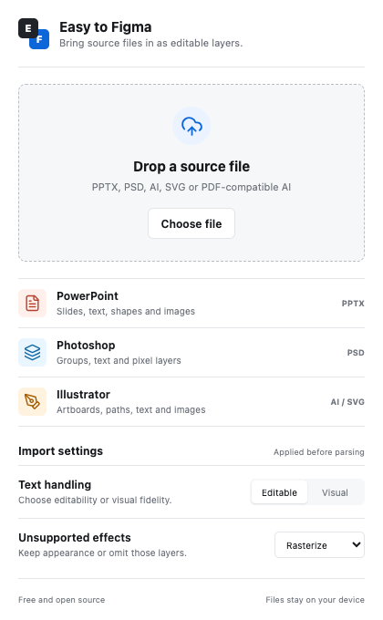
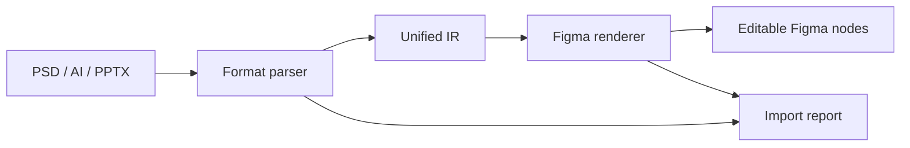

# Easy to Figma

[English](./README.en.md) | 简体中文

[](https://github.com/FishXIN/easy-to-figma/actions/workflows/ci.yml)
[](./LICENSE)
[](https://www.typescriptlang.org/)
[](https://www.figma.com/plugin-docs/)

**把 PSD、AI、PPTX 带进 Figma，并尽可能保持可编辑。**

Easy to Figma 是一个纯免费、开源、跨平台的 Figma 导入工具。它通过统一中间层解析源文件，在 Figma 中重建页面、图层、文字、形状、矢量与图片，并对无法等价表达的效果提供明确、可控的降级报告。



## 当前能力

| 格式 | 可编辑保留 | 可控降级 |
| --- | --- | --- |
| PPTX | 页面、文本、基础形状、图片、简单表格、分组 | 高级图表、SmartArt、动画 |
| PSD | 图层组、文本、可见性、不透明度、混合模式 | 像素层、复杂样式与滤镜 |
| AI / SVG | 画板、路径、文本、基础图形、嵌入图片 | PDF-compatible AI 按画板高分辨率栅格化 |

> AI 私有格式没有公开、稳定的完整规范。推荐将 AI 保存为 SVG 以保留路径可编辑性；启用 “Create PDF Compatible File” 时也可导入，但复杂内容会按画板降级。

文件上限：PPTX / PSD 为 500 MB，AI / SVG / PDF-compatible AI 为 1.5 GB。超大 AI 画板会自动分片，避免缩放或超过 Figma 图片限制。

## 设计原则

- **可编辑优先**：能映射到 Figma 原生节点，就不拍平。
- **结构优先**：尽量保留页面、分组、命名和父子层级。
- **可降级不崩溃**：不支持的局部效果转为图片或跳过，并写入报告。
- **本地处理**：文件解析在插件内完成，不上传源文件。
- **跨平台**：同一套 TypeScript 代码支持 macOS 与 Windows。

## 快速开始

要求 Node.js 20 或更高版本。

```bash
git clone https://github.com/FishXIN/easy-to-figma.git
cd easy-to-figma
npm install
npm run check
```

在 Figma Desktop 中：

1. 打开 `Plugins` → `Development` → `Import plugin from manifest...`
2. 选择 `apps/figma-plugin/manifest.json`
3. 运行 `Easy to Figma`
4. 拖入 `.pptx`、`.psd`、`.ai`、`.svg` 或 PDF-compatible AI 文件

开发插件 UI：

```bash
npm run dev
```

生产构建：

```bash
npm run build
```

构建产物位于 `apps/figma-plugin/dist/`。

## 架构



```text
apps/
  figma-plugin/       Figma 主线程与 React UI
packages/
  ir-schema/          统一中间表示
  parser-pptx/        PPTX 解析器
  parser-psd/         PSD 解析器
  parser-ai/          AI / SVG / PDF-compatible AI 解析器
  figma-renderer/     IR 到 Figma 原生节点
docs/                 产品、架构与格式映射文档
```

详细文档：

- [产品范围](./docs/product.md)
- [技术架构](./docs/architecture.md)
- [IR Schema](./docs/ir-schema.md)
- [格式映射与降级策略](./docs/format-mapping.md)

## 开发状态

当前版本为 `v0.1.2`，已打通三类文件到 Figma 的主链路，并通过两份最高 909 MB 的真实 Illustrator 文件验证。重点仍是兼容更多真实世界文件、提高文字与变换还原精度，以及补充公开测试样本。

路线图：

- `v0.2`：字体映射、蒙版、渐变、批量导入
- `v0.3`：重导入、表格与图表增强、大文件性能优化
- `v1.0`：稳定的三格式导入、完整测试样本与发布流程

## 参与贡献

欢迎提交解析器、格式样本、兼容性修复和文档改进。开始前请阅读 [CONTRIBUTING.md](./CONTRIBUTING.md) 与 [CODE_OF_CONDUCT.md](./CODE_OF_CONDUCT.md)。

发现安全问题时请勿公开提交 Issue，参见 [SECURITY.md](./SECURITY.md)。

## 许可证

[MIT](./LICENSE) © 2026 FishXIN
