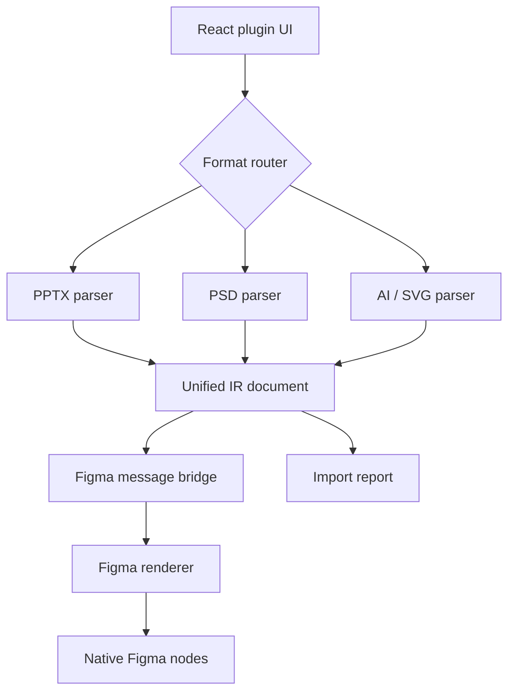
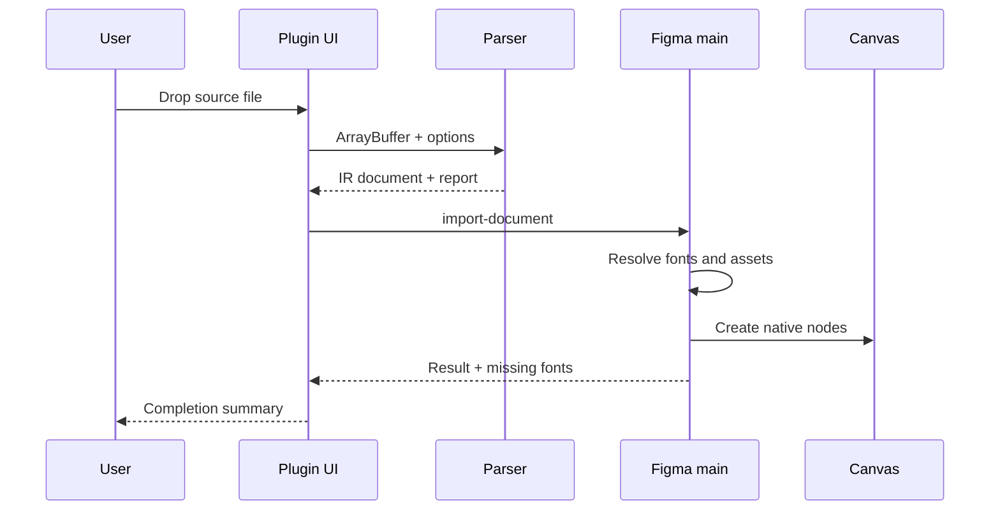

# Architecture

## Overview

Easy to Figma separates format parsing from Figma rendering through a versioned intermediate representation (IR).

## Runtime Boundaries

### Plugin UI iframe

The UI receives source files and runs format parsers. Browser APIs are available here, including ZIP handling, XML parsing, canvas rendering, and PDF.js.

Large binary work stays outside the Figma main-thread sandbox. The resulting serializable IR document is sent through `postMessage`.

### Figma main thread

The main thread owns document mutation:

- Loads available fonts
- Creates frames, text, geometry, vectors, and image fills
- Restores hierarchy and common visual properties
- Selects and reveals imported pages
- Returns missing-font and node-count results to the UI

## Package Boundaries

| Package | Responsibility |
| --- | --- |
| `ir-schema` | Shared node, asset, paint, effect, and report contracts |
| `parser-pptx` | Open XML package parsing and slide conversion |
| `parser-psd` | PSD layer-tree parsing and per-layer fallback |
| `parser-ai` | SVG conversion and PDF-compatible AI rendering |
| `figma-renderer` | IR-to-Figma node creation |
| `figma-plugin` | User interface and UI/main-thread messaging |

Parsers do not call the Figma API. The renderer does not understand source-format XML or PSD structures.

## Import Sequence

## Asset Transport

Embedded source images are represented as data URLs in V0.1. The UI can serialize these values safely through the plugin bridge, and the renderer converts their base64 payload into Figma image hashes.

Future large-file work should replace repeated data URLs with transferable binary chunks or an indexed asset channel.

## Failure Model

- Invalid container or XML: stop parsing and show a user-facing error.
- Unsupported local object: rasterize or skip according to import settings.
- Missing image relationship: skip the object and add a report warning.
- Missing font: use an available fallback and return the original family/style in the result.
- Renderer failure: preserve the parser report and surface the Figma API error.

## Security and Privacy

- No source content is uploaded.
- The plugin manifest allows no network domains.
- File handling occurs in memory.
- PDF.js is kept on a patched release and initialized with a bundled worker.
- CI runs tests, type checks, production builds, and dependency review.
